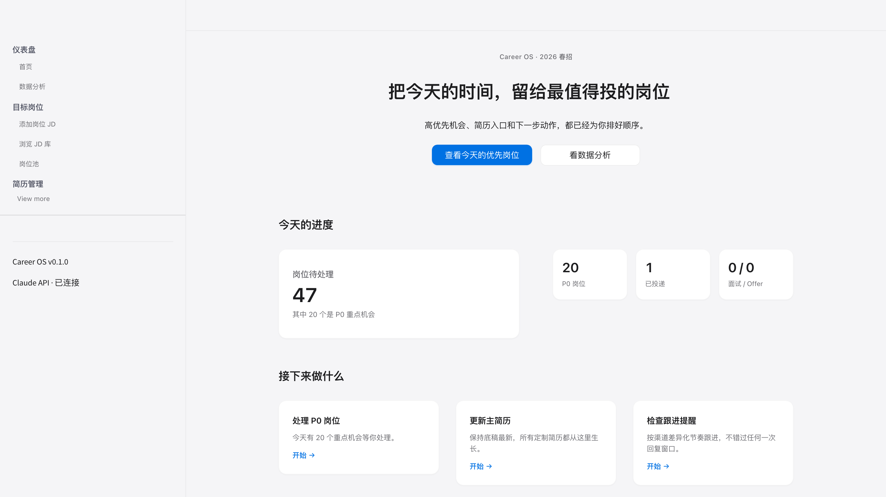
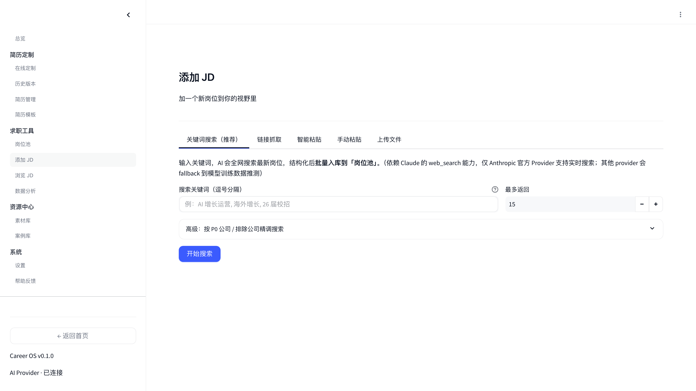
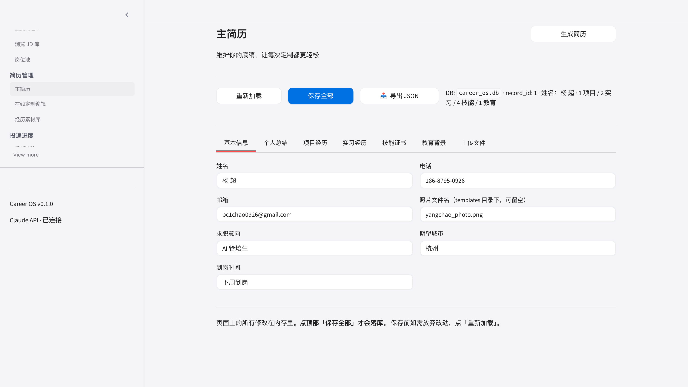
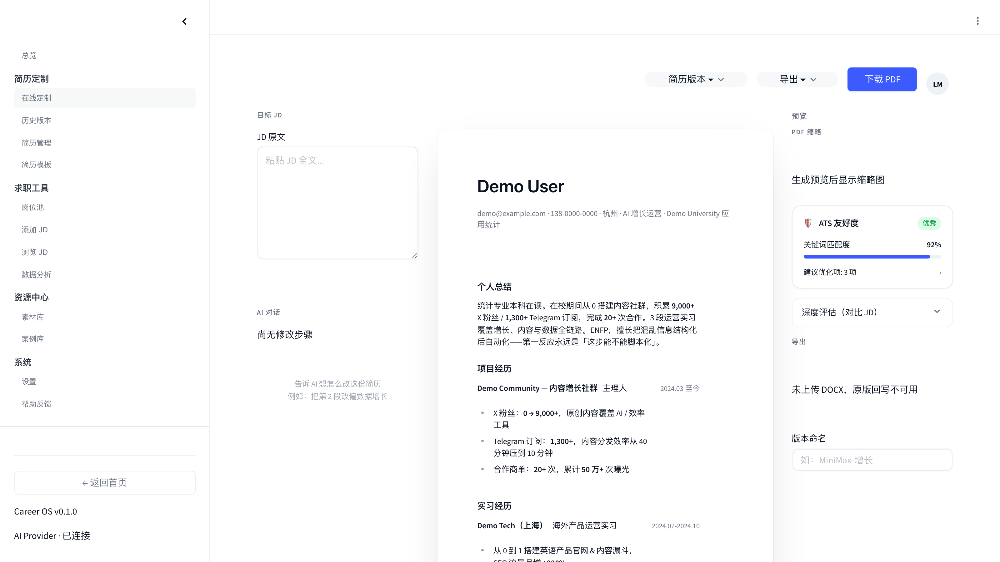
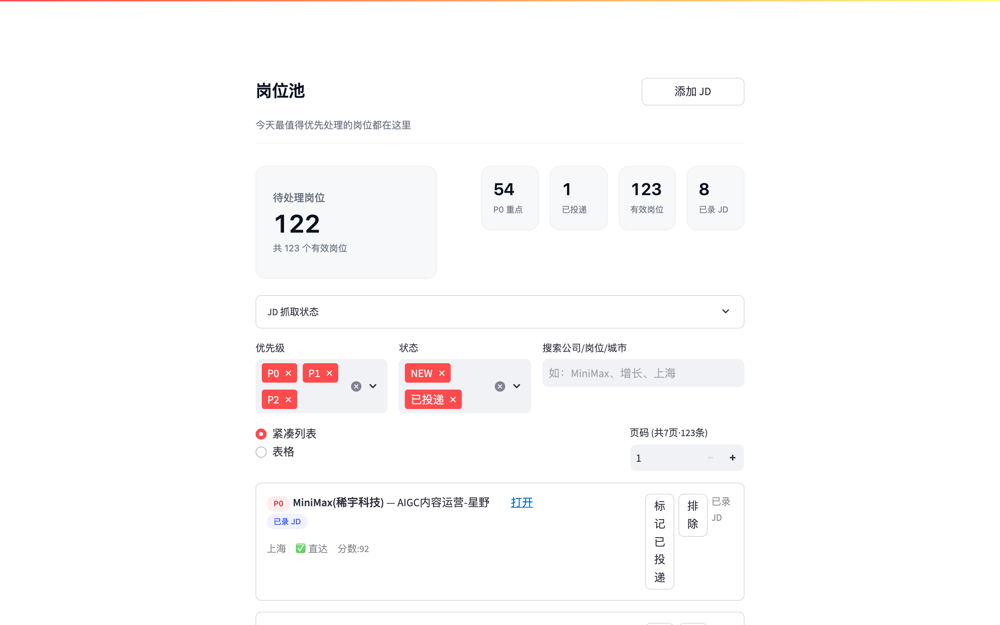
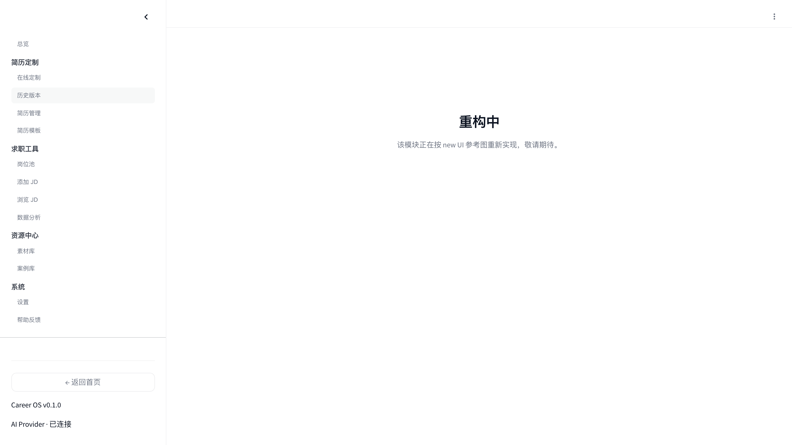
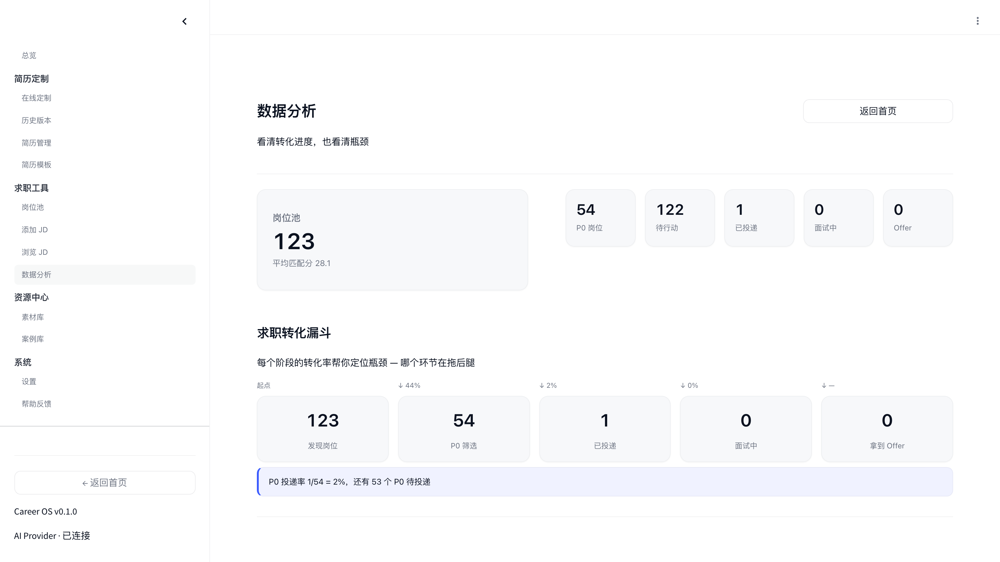

# CareerOS — 属于你自己的 offer 网站

> 配一次 API，跑一次本地，每份简历都为岗位量身定制。

[](https://www.python.org/)
[](./LICENSE)
[](https://streamlit.io/)
[](https://www.anthropic.com/)
[](https://platform.openai.com/)
[](./CHANGELOG.md)

---

## 它是什么

**CareerOS** 是一个本地跑的求职一体化 webapp。你把**主简历**和**目标岗位 JD** 丢给它，AI 会：

1. 给每个岗位算一个 **match_score**，告诉你匹配度和差距
2. **改写**你的主简历，生成该岗位量身定制的版本（保留所有硬事实不编造）
3. **输出 PDF**，直接投
4. 帮你**追踪**投递进度、生成跟进话术、准备面试

所有数据都在你自己的电脑上（SQLite 单文件），API Key 也是你自己的，作者看不到任何东西。

**公网 demo 隐私契约**（[careeros-chad.streamlit.app](https://careeros-chad.streamlit.app)）：每个新浏览器 session 启动时自动 wipe 12 张用户私有表（简历 / 投递 / 联系人 / 邮件队列 / 面试题等），同 session 内自由编辑保存，关掉浏览器或换设备 = 不见前任访客数据。

**支持的 LLM Provider**（v0.6.0 起，设置页下拉切换 · `openai` SDK pip 依赖已摘除，所有 OpenAI-wire provider 走原生 `httpx` 直连，部署不再因 SDK 安装失败而报错）：

| Provider | 协议 | 默认模型 | 场景 |
|---|---|---|---|
| 🎁 **Codex 公开池** | OpenAI wire | `gpt-5.4` | 初期免费共享，**零配置试玩** |
| **OpenAI 官方** | OpenAI wire | `gpt-4o-mini` | 有 `sk-...` 的用户 |
| **Anthropic 官方** | Anthropic wire | `claude-sonnet-4-6` | 有 `sk-ant-...` 的用户 |
| 自定义代理 | 兼容 Anthropic | 自定义 | 国内反代 / 私有部署 |

---

## 截图

> Nature × Apple 设计语言，14 个页面。下面 7 张图对应 README 后文提到的核心能力。

### 首页 · 今天该做什么

岗位待处理 · P0 重点机会 · 已投递 / 面试 Offer —— 打开就知道今天的动作清单。

### 添加岗位 JD · 4 种入口

关键词全网搜（依赖 Anthropic `web_search`）/ 链接抓取（Moka · 飞书）/ 智能粘贴 / 手动 / 上传 PDF。

### 主简历 · 7 个 tab 的底稿

基本信息 / 个人总结 / 项目 / 实习 / 技能 / 教育 / 文件上传 —— 所有定制版都从这份底稿生出来。

### 在线定制 · JD × 主简历 × 实时预览

左栏贴 JD、中栏改段落、右栏 1:1 预览新 PDF（可与原始 PDF 对照）。历史版本自动沉淀。

### 投递追踪 · 岗位池 + 多维过滤

五维状态卡片（待处理 / P0 重点 / 已投递 / 有效岗位 / 已录 JD）+ 优先级与状态过滤芯片，按 fit_score 排序。

### 历史版本 · 一份 JD 多次 tailor 全留痕

每次定制都自动归档，可对比、可回滚、可批量导出。

### 数据分析 · 漏斗诊断转化

求职转化漏斗、P0 投递率、岗位等级分布、P0 待行动清单 —— 看清每一环在哪拖后腿。

---

## 5 分钟快速开始（本地）

```bash
# 1. Clone
git clone https://github.com/cryptoyc0926/careeros.git
cd careeros

# 2. 装依赖
python -m venv venv && source venv/bin/activate    # Windows: venv\Scripts\activate
pip install -r web/requirements.txt

# 3. 拷贝 .env 模板，填入你的 Claude API Key
cp web/.env.example web/.env
# 编辑 web/.env，填 ANTHROPIC_API_KEY=sk-ant-...

# 4. 启动
streamlit run web/app.py
# → 浏览器自动打开 http://localhost:8501
```

第一次打开会引导你：

1. **填个人画像**（姓名/学校/专业/目标岗位，3 分钟）
2. **选 Provider**（公网 demo 默认走 🎁 Codex 公开池，零配置试玩；本地自建推荐 Anthropic/OpenAI 官方，Key 填 `.env` 或 UI 里）
3. **填主简历** 或上传 PDF/DOCX（系统会解析，解析失败也能手填）
4. **加第一个目标岗位**（粘贴 JD 链接或文本）
5. 点「生成定制简历」→ **下载 PDF**

---

## 核心功能

| 模块 | 能力 |
|---|---|
| 🎯 **JD 入库** | 4 种方式：粘贴链接（支持 Moka/飞书）/ AI 智能解析 / 手动 / 上传 PDF |
| 📝 **简历定制** | AI 按 JD 改写主简历，保留硬事实不编造，生成 match_score；内置写作规则四件套（加粗 / 排版 / STAR 6 步法 / 5 槽位个人总结） |
| 📊 **投递追踪** | 看板（已收藏/已投递/跟进中/面试/Offer）+ 漏斗 + 转化率诊断 |
| 💬 **面试准备** | STAR 故事库 / 八股题 / 群面题 / 牛客面经导入 |
| 📧 **邮件模板** | 内推 / 投递 / 跟进 三类话术一键生成（从你的个人画像注入）|
| ⭐ **STAR 素材池** | 经历沉淀为复用素材，跨岗位调度 |

---

## 部署到自己机器

按上面"5 分钟快速开始"跑起来就是完整功能版。

如果想把它挂到公网（让朋友用、或自己远程访问）：
- 容器部署：已提供 `Dockerfile`，可上 Railway / HuggingFace Spaces / 个人 VPS
- 完整方案见 [DEPLOY.md](./DEPLOY.md)

---

## 技术栈

- **Frontend**：Streamlit 1.38+（14 个页面 / Nature × Apple 设计语言）
- **AI**：Anthropic Claude（Opus/Sonnet）+ OpenAI 兼容层（Codex 公开池 / GPT 系列）
- **Storage**：SQLite（纯文件，零依赖）· 数据库 schema 19 张表
- **PDF**：WeasyPrint + Jinja2（自定义 resume 模板）
- **JD 抓取**：requests + BeautifulSoup（SPA 站点可选 Playwright）
- **Prompt 规则**：统一规则常量（`services/resume_prompt_rules.py`）· BOLD_RULES / DEAI_RULES
- **Python**：3.10+

---

## 术语对照（新人 3 分钟看懂）

| 术语 | 含义 |
|---|---|
| **P0 / P1 / P2** | 优先级：主攻 / 积极投递 / 备选 |
| **fit_score / 匹配分** | AI 给这个岗位 × 你主简历打的 0-100 分 |
| **STAR** | 面试故事结构：Situation · Task · Action · Result |
| **adapter** | JD 抓取模式（auto = HTML 直抓 / browser = Playwright 渲染 / manual = 手动）|
| **主简历 / 定制简历** | 主简历 = 底稿（长版本）；定制简历 = 针对具体岗位的改写版 |

---

## 已知限制（v0.1.x 诚实告知）

不完美的地方提前讲清楚，避免失望：

| 场景 | 当前状态 | 绕过方式 |
|---|---|---|
| **PDF 模板保真编辑** | ❌ 未实现 | 系统生成的新 PDF 用 CareerOS 内置模板，**不保留原 PDF 的视觉排版**。右栏保留原 PDF 对照 |
| **规则解析对非标简历覆盖** | ~70-80% 字段 | 识别率低时 UI 会提示切到「🤖 AI 智能解析」用 Claude 兜底 |
| **关键词全网搜索** | 仅 **Anthropic 官方** provider 支持实时 `web_search` | Kimi/GLM/DeepSeek 会 fallback 到模型训练数据推测（非实时） |
| **云端数据持久化** | Streamlit Cloud 重启会丢数据 | 每次用完到「系统设置 → 数据备份」下载 JSON 到同步盘；下次导入恢复 |
| **云端 API Key 存储** | 关闭浏览器 session 就清空 | BYO-Key 模式设计如此（作者零成本，用户零信任风险） |
| **中国区招聘网站抓取** | BOSS/猎聘/飞书等需 Playwright | 本地部署可装；云端不支持，改用「智能粘贴」或「关键词搜索」 |
| **简历上传自动填** | 对**部分格式**可能漏字段 | 能识别 90%+ 标准格式；特殊格式切 AI 解析或手动补 |

遇到解析出错的简历 / 用起来有反直觉的地方，欢迎 [提 issue](https://github.com/cryptoyc0926/careeros/issues) 附：
1. 失败的简历 PDF（可先去隐私化）
2. 系统设置 → 最近错误日志的内容（一键复制）

## Roadmap

- [x] v5 Apple UI 收敛（20 节 CSS + 29 组件 + Nature × Apple 风格）
- [x] 隐私清理 + 通用化开源（v0.1.0）
- [x] 简历规则体系 v2.0（统一加粗/DEAI 规则常量，v0.2.0）
- [x] OpenAI/Codex 协议兼容 + 公开池试玩（v0.3.0）
- [ ] Gemini / LiteLLM 抽象层
- [ ] 英文版（多语言）
- [ ] Onboarding 引导页（首启动 4 步向导）
- [ ] PWA 离线模式
- [ ] 社区功能（故事库共享、模板市场）

---

## 贡献

欢迎 PR。见 [CONTRIBUTING.md](./CONTRIBUTING.md)。

**我特别希望收到的贡献**：
- 更多 resume 模板（只要没硬编码个人信息即可）
- 其他 LLM provider 的适配层
- 英文/日文本地化

---

## License

[MIT](./LICENSE) — 自由商用 / 修改 / 再分发，附上原始版权声明即可。

---

## 致谢

构建过程中大量使用 [Claude Code](https://claude.com/claude-code) 协作完成。项目结构与 UI 系统受 Linear / Nature / Apple 官网启发。
